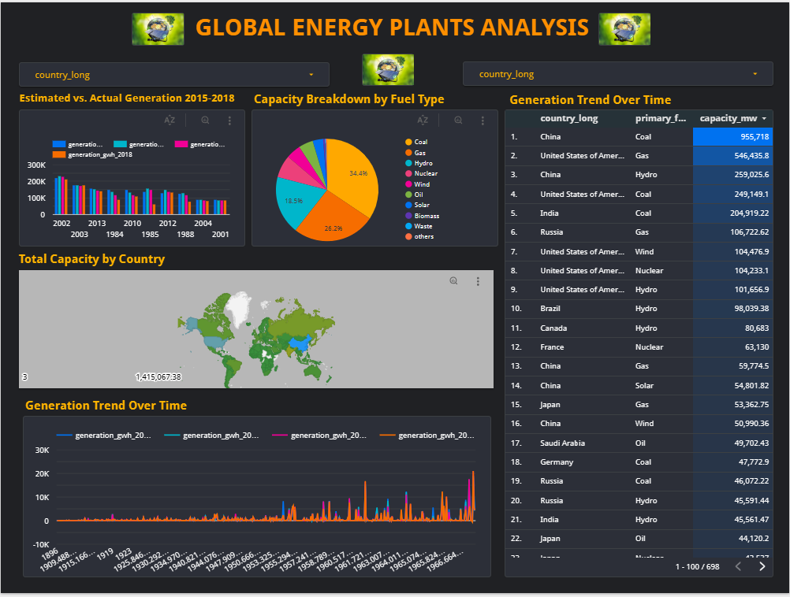

# Global-Power-Plant-Dashboard

## Content
 - [Introduction] (#Introduction) 
 - [Problem Statement](#ProblemStatement)
 - [Cloud(IaC)](#Cloud(IaC))
 - [Data Ingestion(Batch)](#DataIngestion(Batch))
 - [Data Warehousing](#DataWarehousing)
 - [Transformation](#Transformation)
 - [Dashboard](#Dashboard)
 - [Summary](#Summary)

## Introduction
This project seeks to leverage the Global Power Plant Database to provide actionable insights into the global energy landscape. It is being undertaken as the final project for my participation in the Data Engineering Zoomcamp course. Power generation is a critical component of modern society, and understanding its evolution, efficiency, and environmental impact is essential for informed decision-making.

The Global Power Plant Database offers unprecedented access to detailed information on power plants worldwide, including their location, capacity, fuel type, and generation. However, unlocking the full potential of this data requires careful data engineering, analysis, and visualization.

### Goals
This project aims to:

- **Cleanse and structure the data:** Address inconsistencies, missing values, and formatting issues to create a reliable foundation for analysis. Reveal global power trends: Visualize and analyze patterns in the use of fossil fuels vs. renewables, regional disparities in energy transition, and the evolution of power plant capacity over time.
- **Assess efficiency and optimization:** Explore the relationship between power plant characteristics (age, fuel type, etc.) and efficiency. Develop models to identify potential areas for improved performance.
- **Map power grid vulnerabilities:** Analyze the geographic distribution and capacity of power plants to highlight potential points of failure and opportunities for enhancing grid resilience.
- **Quantify environmental impacts:** Where possible, integrate data on emissions, water usage, and air quality to assess the environmental cost of different power generation methods across regions.

### Why this Project Matters
The insights derived from this project can inform stakeholders across the energy sector:
 
 - **Policymakers:** Gain a data-driven understanding for better energy policy design and infrastructure planning.
 - **Energy Companies:** Identify optimization opportunities, assess market trends, and benchmark performance against industry standards.
 - **Environmental Organizations:** Quantify and visualize the environmental impact of different power generation strategies to support advocacy and sustainability initiatives.
 - **Researchers:** Access a cleaned and organized dataset for further research into energy systems, sustainability, and climate change mitigation.

## Problem Statement
The Global Power Plant Database offers a wealth of information on power generation facilities worldwide. However, to unlock the full potential of this data, several key challenges and questions need to be addressed:

 - **Data Cleaning and Quality:** With datasets of this size, inconsistencies, missing values, and data quality issues are a common challenge. How can we effectively preprocess and clean the data to ensure its integrity for analysis?

 - **Understanding Global Energy Trends:** Can the dataset reveal patterns in the adoption of different fuel types (fossil fuels vs. renewables) over time? Are there regional disparities in transitioning to cleaner energy sources?

 - **Assessing Power Plant Efficiency:**  Is it possible to analyze the relationship between a power plant's age, fuel type, capacity, and its overall efficiency? Identifying patterns here can guide efforts in optimizing existing infrastructure.

 - **Power Grid Interdependencies:** Analyzing power plant locations and capacities can shed light on regional grid vulnerabilities and resilience. Where are single points of failure in the power grid, and how can these be mitigated?

 - **Environmental Impact Quantification:**  The dataset can be used to correlate power plants with data on emissions, regional air quality, and water usage. This can help quantify the environmental footprint of different regions and power generation technologies.

This data engineering project aims to tackle these questions through:

  - [ ] Rigorous data cleansing and validation techniques.
  - [ ] Creating visualizations and statistical analyses to uncover trends in power generation.
  - [ ] Building models to explore power plant efficiency and grid reliability factors.

## Cloud(IaC)
This project leverages Infrastructure as Code (IaC) principles to manage and deploy the infrastructure required for data processing and analysis. Specifically, this project utilizes HashiCorp Terraform alongside Google Cloud Platform (GCP).

 - **Terraform:** Terraform is an open-source tool that allows you to define infrastructure resources (like compute instances, storage buckets, and databases) in human-readable configuration files. This enables a declarative approach to infrastructure management, promoting consistency, repeatability, and version control.

  - **Google Cloud Platform (GCP):** GCP serves as the cloud provider for this project, offering a suite of scalable and reliable services for data storage, processing, and analysis. Terraform configurations are used to provision and manage these GCP resources required for the project's workflow.

## Data Ingestion(Batch)
This project implements a batch data ingestion pipeline to acquire, process, and store the Global Power Plant Database.

 - **Mage.ai:** This project utilizes Mage.ai, an open-source platform designed for building and managing data pipelines. Mage.ai provides a user-friendly interface for defining data processing tasks and orchestrating their execution in a reliable and scalable manner.

The data ingestion process follows these steps:

 - **Acquiring Raw Data:** Mage.ai tasks are configured to download the latest version of the Global Power Plant Database from the source website.
 - **Data Transformation:** Downloaded data might require cleaning, transformation, and validation before loading into the target database. Mage.ai pipelines can be designed to handle these tasks efficiently.
- **Loading to PostgreSQL:** The cleaned and transformed data is then loaded into a PostgreSQL database instance hosted on GCP. PostgreSQL offers a robust and scalable relational database management system for structured data storage.
 - **Exporting to Google Cloud Storage (GCS):** Finally, the data is exported from PostgreSQL and stored in a Google Cloud Storage (GCS) bucket. GCS provides a cost-effective and highly available object storage solution for archiving and future access to the processed dataset.
  
## Data Warehousing

## Transformation

## The Dashboard
Click here to access the dashboard :- [GLOBAL ENERGY PLANTS ANALYSIS](https://lookerstudio.google.com/reporting/62b8a7f0-8773-43cb-9b59-9bb8433e34f7)

## Summary

## Reference

<!-- Terraform -->

wget -O- https://apt.releases.hashicorp.com/gpg | sudo gpg --dearmor -o /usr/share/keyrings/hashicorp-archive-keyring.gpg

echo "deb [signed-by=/usr/share/keyrings/hashicorp-archive-keyring.gpg] https://apt.releases.hashicorp.com $(lsb_release -cs) main" | sudo tee /etc/apt/sources.list.d/hashicorp.list

sudo apt update && sudo apt install terraform

<!-- jupyter -->
pip install jupyter

<!-- create docker network -->
docker network create pg-network
<!-- create docker volume -->
docker volume create --name dtc_pg_volume_local -d local 

commissioning_year                               
year_of_capacity_data

'generation_gwh_2013' 'generation_gwh_2014', 'generation_gwh_2015', 'generation_gwh_2016', 'generation_gwh_2017', 'generation_gwh_2018', 'generation_gwh_2019',          
generation_data_source       
estimated_generation_gwh_2013
estimated_generation_gwh_2014
estimated_generation_gwh_2015
estimated_generation_gwh_2016
estimated_generation_gwh_2017 